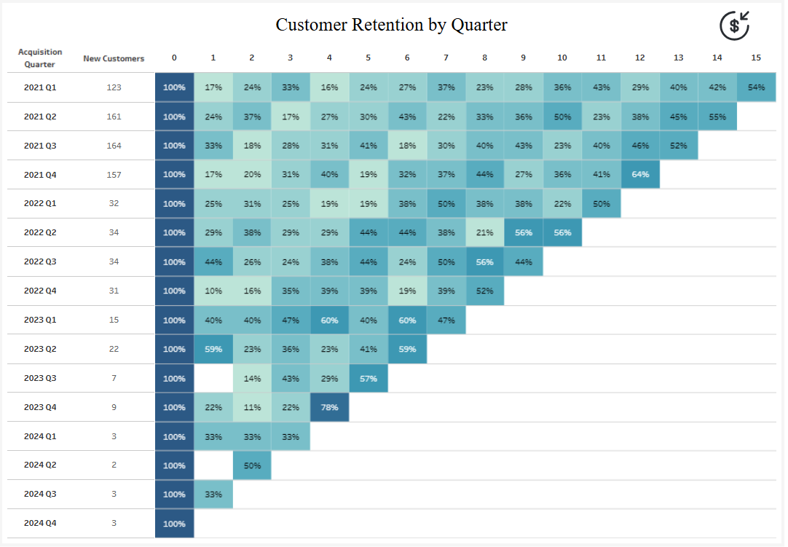

# Customer Retention Cohort Analysis

A Tableau cohort analysis dashboard that visualizes customer retention rates over time, enabling businesses to track customer loyalty, identify retention patterns, and measure the effectiveness of customer success initiatives.


## 📊 Live Dashboard

**[View on Tableau Public](https://public.tableau.com/app/profile/daria.savvateeva/viz/CustomerLifetimeRetention/RetentionRate#1)**

---

## 🖼️ Dashboard Preview



*Cohort retention matrix showing quarterly customer retention rates from acquisition through 15+ quarters*

---

## 💼 Business Value

### What is Cohort Analysis?

Cohort analysis groups customers by their acquisition date (cohort) and tracks their behavior over time. This retention matrix shows what percentage of each customer cohort continues to make purchases in subsequent periods.

### Why Cohort Analysis Matters

**Without cohort analysis**, you might see:
- Total customer count growing → Assume business is healthy
- Average retention rate → Doesn't show if newer or older customers are more loyal

**With cohort analysis**, you can:
- **Identify if retention is improving** - Are recent cohorts more loyal than older ones?
- **Measure product-market fit** - High early retention suggests strong value proposition
- **Calculate customer lifetime value (CLV)** - Predict long-term revenue from each customer
- **Validate business changes** - Did that new feature launched in Q2 2022 improve retention?
- **Detect warning signs early** - Declining retention in recent cohorts signals problems

### Critical Business Questions Answered

1. **"Are we getting better at keeping customers?"**  
   Compare retention curves between early cohorts (2021) and recent cohorts (2023-2024)

2. **"What's our expected customer lifetime?"**  
   Track when retention rates flatten out (customer maturity)

3. **"Which acquisition periods brought the most loyal customers?"**  
   Identify best-performing cohorts and replicate those conditions

4. **"When do most customers churn?"**  
   Spot drop-off periods and implement intervention strategies

5. **"What's the ROI of our customer success program?"**  
   Compare retention before/after program implementation

---

## ✨ Key Features

- **Quarterly Cohort Grouping**: Customers grouped by acquisition quarter
- **15-Quarter Tracking**: Follow retention up to 15 quarters post-acquisition
- **Color-Coded Heat Map**: Darker blue = higher retention, lighter = lower retention
- **Triangular Pattern**: Recent cohorts show fewer periods (haven't existed long enough)
- **New Customer Count**: Shows cohort size for context
- **100% Baseline**: Quarter 0 always shows 100% (all customers start here)
- **Percentage Display**: Clear retention rate labels in each cell

---

## 📈 How to Read This Dashboard

### Understanding the Table

**Rows (Acquisition Quarter)**: When customers first made a purchase  
**Columns (Quarter Number)**: Time since acquisition  
**Values**: % of original cohort still active

### Example Interpretation

**2021 Q1 Cohort:**
- Started with 123 customers (100%)
- Quarter 1: 17% still active (21 customers)
- Quarter 2: 24% still active (30 customers)
- Quarter 15: 54% still active (66 customers)

**Key Insight**: This cohort shows increasing retention over time, possibly indicating customers who stay past the first year become very loyal.

### What Good Looks Like

✅ **Strong retention curve**: Gradual decline that flattens out  
✅ **Improving cohorts**: Recent cohorts retain better than old ones  
✅ **High long-term retention**: 30%+ still active after 8+ quarters  
✅ **Small initial drop**: <50% churn in first 2-3 quarters

### Warning Signs

⚠️ **Steep drop-off**: Losing 50%+ in first quarter  
⚠️ **Declining trend**: Newer cohorts perform worse  
⚠️ **No plateau**: Continuous decline without flattening  
⚠️ **Inconsistent patterns**: Widely varying retention across similar periods

---

## 🛠️ How to Build This in Tableau

### Prerequisites

- Tableau Desktop or Tableau Public
- Dataset with:
  - **Customer ID** (unique identifier)
  - **Order Date** (transaction date)
  - **Order ID** (to count transactions)

**Sample Data Structure:**
```
Customer ID | Order Date  | Order ID
------------|-------------|----------
CUST001     | 2021-01-15  | ORD-001
CUST001     | 2021-04-20  | ORD-002
CUST002     | 2021-02-10  | ORD-003
```

**Note**: This dashboard uses Tableau's built-in "Sample - EU Superstore" dataset. You can use any dataset with customer purchase history.

---
---

## 📖 Step-by-Step Build Guide

### Prerequisites
- Tableau Desktop or Tableau Public
- Dataset with: Customer Name, Order Date fields
- Sample data structure:
  ```
  Customer Name | Order Date
  --------------|------------
  John Smith    | 2021-01-15
  John Smith    | 2021-04-20
  Jane Doe      | 2021-02-10
  ```

### Data Preparation
Before starting, ensure your data has:
- A **Customer Name** field (unique customer identifier)
- An **Order Date** field (transaction date)
- Ideally multiple years of purchase data

---

### Step 1: Determine Acquisition Quarter

This calculation identifies when each customer first made a purchase and groups them by quarter:

#### Acquisition Quarter
```tableau
DATE({FIXED [Customer Name]: MIN(DATETRUNC('quarter', [Order Date]))})
```

**What this does**: 
- `{FIXED [Customer Name]: MIN(...)}` - For each customer, finds their very first order date
- `DATETRUNC('quarter', [Order Date])` - Truncates to the start of the quarter
- `DATE(...)` - Wraps in DATE() function for proper date formatting
- This creates the cohort grouping

**Important**: This will be placed on **Rows** as a **discrete (blue) exact date** dimension

**Example**: If a customer's first order was March 15, 2021, this returns 2021-01-01 (Q1 2021)

---

### Step 2: Calculate Quarters Since First Order

Determine how many quarters have passed since each customer's first purchase:

#### Quarters Since First Order
```tableau
DATEDIFF('quarter', [Acquisition Quarter], DATETRUNC('quarter', [Order Date]))
```

**What this does**: 
- Takes the difference in quarters between acquisition and current order
- `DATETRUNC('quarter', [Order Date])` - Truncates current order to quarter start
- Returns 0 for orders in acquisition quarter, 1 for next quarter, etc.

**Important**: This will be placed on **Columns** as a **discrete (blue) dimension**

**Example**:
- Customer acquired in Q1 2021 (Jan-Mar)
- Order placed in Q1 2021 → Returns 0
- Order placed in Q2 2021 → Returns 1
- Order placed in Q3 2021 → Returns 2

---

### Step 3: Count New Customers per Cohort

Create a calculation that counts unique customers acquired in each quarter:

#### New Customers
```tableau
{FIXED [Acquisition Quarter]: COUNTD([Customer Name])}
```

**Purpose**: 
- Shows cohort size for context
- Larger cohorts may have different retention patterns
- Used as denominator in retention rate calculation

**Important**: This will be placed on **Rows** after Acquisition Quarter as a **discrete dimension**

**Example**: If 123 customers made their first purchase in Q1 2021, this returns 123

---

### Step 4: Calculate Retention Rate

The key metric - what percentage of the original cohort is still active:

#### Retention Rate
```tableau
COUNTD([Customer Name]) / SUM([New Customers])
```

**Format**: Percentage, 0 decimal places

**Logic**:
- **Numerator**: `COUNTD([Customer Name])` - How many unique customers from this cohort made purchases in this period
- **Denominator**: `SUM([New Customers])` - How many customers were in this cohort originally
- **Result**: % of original cohort still active

**Important**: 
- This goes on **Color** shelf (creates heat map)
- Also place on **Text** shelf to display percentages

---

### Step 5: Build the Cohort Table

#### 5.1 Create Worksheet
1. Create new worksheet
2. Name it "Retention Rate" or "Cohort Analysis"

#### 5.2 Add Dimensions to Rows
1. **Drag [Acquisition Quarter] to Rows**
   - Make sure it's **discrete (blue pill)**
   - Change to **exact date** (right-click → select second option under date)
   - Right-click → Sort → Descending (newest on bottom) or Ascending (oldest on top)

2. **Drag [New Customers] to Rows** (place after Acquisition Quarter)
   - Make sure it's **discrete (blue pill)**
   - This displays cohort size next to each acquisition quarter

#### 5.3 Add Dimension to Columns
1. **Drag [Quarters Since First Order] to Columns**
   - Ensure it's **discrete (blue pill)**
   - Right-click → Sort → Ascending (0, 1, 2, 3...)
   - This creates the columns showing time progression

#### 5.4 Add Metrics
1. **Drag [Retention Rate] to Color**
   - Creates heat map visualization
   - High retention = darker blue
   - Low retention = lighter blue

#### 5.5 Format the View
1. **Change Mark Type**: 
   - Click Marks card → Change to **Square**
   - Change Fit to Entire View

2. **Color Scheme**:
   - Click Color → Choose Blue sequential palette
   - Ensure darker = higher retention
   - Click "Reversed" if needed

3. **Text Labels**:
   - Click Label → Format as percentage
   - Bold font, center alignment
   - Adjust size (10-12pt works well)

4. **Borders**:
   - Format → Borders
   - Add light gray cell borders for clarity

---

### Step 6: Final Formatting

1. **Headers**:
   - Keep column headers (0, 1, 2, 3...) visible
   - These indicate quarters since acquisition

2. **Title**:
   - Add descriptive title: "Customer Retention by Quarter"
   - Include subtitle explaining the metric

3. **Tooltips** (optional):
   - Customize to show: Acquisition Quarter, Quarters Since First Order, Retention Rate, Number of Active Customers

---

## ✅ Final Checklist

- [ ] Acquisition Quarter on Rows (discrete, exact date)
- [ ] New Customers on Rows (discrete)
- [ ] Quarters Since First Order on Columns (discrete)
- [ ] Retention Rate on Color (blue scale)
- [ ] Mark type is Square
- [ ] Colors are sequential (darker = better)
- [ ] Text is readable and centered

---

Your cohort retention matrix is now complete!

1. Click on Marks card
2. Change from Automatic to **Square**
3. Change Fit to Entire View

---

### Step 8: Format the Visualization

#### 8.1 Color Scheme
1. Click Color on Marks card
2. Choose a sequential palette:
   - **Blue** (light to dark) - recommended
   - **Teal** or **Blue-Green** work well
3. Click "Reversed" if needed (darker = higher retention)
4. Adjust stepped color if desired

#### 8.2 Text Labels
1. Click Label on Marks card
2. Format: **Percentage, 0 decimals**
3. Font: Bold, appropriate size (10-12pt)
4. Alignment: Center
5. Click "Show mark labels"

#### 8.3 Remove Headers (Optional)
- For cleaner look, keep headers
- For presentation, you can customize axis titles

#### 8.4 Borders
1. Format → Borders
2. Row Divider: Light gray
3. Column Divider: Light gray
4. Cell: White or light gray

#### 8.5 Title
- Right-click title → Edit Title
- Example: "Customer Retention by Quarter"
- Add subtitle explaining the view

---

### Step 9: Add Context and Labels

#### 9.1 Column Headers
The quarters since acquisition (0, 1, 2, 3...) are self-explanatory.

Optionally add a text note:
- "0 = Acquisition quarter"
- "1 = One quarter later"
- etc.

#### 9.2 Cohort Size Column
The "New Customers" column shows cohort size - this is crucial context:
- Larger cohorts may have different retention patterns
- Helps assess statistical significance

#### 9.3 Dashboard Title
Add a clear title explaining the metric:
- "Customer Retention by Acquisition Cohort"
- "Quarterly Cohort Retention Analysis"

---

### Step 10: Add Interactivity (Optional)
Enhance tooltips to show:
```
Acquisition Quarter: <Acquisition Quarter>
Quarters Since Acquisition: <Quarters Since Acquisition>
Retention Rate: <AGG(Retention Rate)>
Customers Active: <COUNTD(Customer ID)>
Original Cohort Size: <New Customers>
```
---

## 📊 Advanced Variations

### Monthly Cohorts
Change granularity for more detailed analysis:
```tableau
// Acquisition Month
DATETRUNC('month', [First Purchase Date])

// Months Since Acquisition  
DATEDIFF('month', [First Purchase Date], [Order Date])
```

**Use case**: More granular for businesses with short sales cycles

---

### Revenue Retention
Track revenue instead of customer count:
```tableau
// Revenue Retention Rate
SUM([Sales]) / {FIXED [Acquisition Quarter]: SUM([Sales])}
```

**Insight**: Shows if retained customers are spending more or less over time

---

### Cumulative Retention
Show cumulative percentages:
```tableau
// Customers who have returned at least once by this quarter
COUNTD(IF [Quarters Since Acquisition] <= [Current Quarter] 
       THEN [Customer ID] END) 
/ [New Customers]
```

---

### Churn Rate View
Flip the metric to show churn instead of retention:
```tableau
// Churn Rate
1 - [Retention Rate]
```

**Use case**: Some stakeholders prefer to see churn directly

---

## 🎯 Business Applications

### 1. Product-Market Fit Validation
**Question**: "Do customers love our product enough to stick around?"  
**How**: Look at long-term retention (quarters 8-12)  
**Good**: >30% retention at quarter 12  
**Action**: If low, investigate product value proposition

### 2. Customer Success Program ROI
**Question**: "Is our onboarding/CS program working?"  
**How**: Compare cohorts before/after program launch  
**Example**: 2022 Q1 vs 2021 Q1 retention curves  
**Action**: Expand or modify program based on results

### 3. Pricing Strategy Validation
**Question**: "Did the price increase hurt retention?"  
**How**: Compare retention of cohorts before/after price change  
**Watch for**: Steeper drop-off in post-change cohorts  
**Action**: Consider grandfathering or value adds

### 4. Marketing Channel Effectiveness
**Question**: "Which acquisition channels bring quality customers?"  
**How**: Segment cohorts by acquisition channel  
**Compare**: Paid ads vs organic vs referrals  
**Action**: Invest more in channels with better retention

### 5. Seasonal Insights
**Question**: "Do Q4 holiday customers stick around?"  
**How**: Compare Q4 cohort retention to other quarters  
**Finding**: Often lower (gift buyers, deal seekers)  
**Action**: Targeted re-engagement campaigns

---

## 📝 Files Included

```
customer-retention-tableau/
├── dashboards/
│   └── Customer_Lifetime_Retention.twbx    # Tableau workbook
├── screenshots/
│   └── customer_retention.png              # Dashboard preview
├── .gitignore
├── LICENSE
└── README.md                               # This file
```

**Note**: This dashboard uses Tableau's built-in "Sample - EU Superstore" dataset. No separate data files needed.

---

## 🚀 Getting Started

### View Online
Visit the [Tableau Public link](https://public.tableau.com/app/profile/daria.savvateeva/viz/CustomerLifetimeRetention/RetentionRate#1) to interact with the dashboard.

### Download and Customize
1. Download `Customer_Lifetime_Retention.twbx` from the `dashboards/` folder
2. Open in Tableau Desktop or Tableau Public
3. Connect to your own customer data
4. Adjust calculations for your business logic (monthly vs quarterly cohorts)
5. Customize colors and formatting

---

## 📄 License

This project is available under the MIT License - feel free to use and modify for your own purposes.

---

## 👤 Author

**Daria Savvateeva**
- Tableau Public: [@daria.savvateeva](https://public.tableau.com/app/profile/daria.savvateeva)
- GitHub: [@DariaSavva](https://github.com/DariaSavva)

---

## 🙏 Acknowledgments

- Built using Tableau's Sample - EU Superstore dataset
- Cohort analysis methodology based on industry best practices
- Inspired by retention analysis frameworks from leading SaaS companies

---

**Built with Tableau | Last Updated: January 2025**
